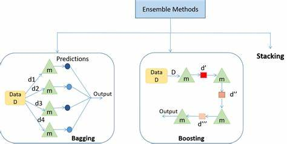

# **Ensemble Learning**  
___  

  

This notebook uses Texas weather data to explore and implement various **Ensemble Learning** techniques, including **Bagging**, **Boosting**, and **Stacking**, to classify days based on average temperature into categories: `cold`, `warm`, and `hot`. The objective is to develop a deeper understanding of ensemble learning methods and how combining multiple models can lead to better performance and robustness in classification tasks.

---

## **Overview** 

 
**Ensemble Learning** refers to techniques that combines predictions from multiple machine learning models to improve accuracy, reduce overfitting, and boost overall model performance. This notebook walks through three key ensemble methods wich include:

- **Bagging (Bootstrap Aggregating)**: Trains multiple models on different random subsets of the data and averages or votes on their predictions. (we used Random Forest)
- **Boosting**: Builds models sequentially, with each model correcting the errors of its predecessor. (we used Gradient Boosting)
- **Stacking**: Combines predictions from several base models using a meta-model that learns how to best weigh each one.

Each technique is implemented using `scikit-learn` and evaluated with cross-validation and classification metrics to determine which method best fits the task of temperature classification.

---

## **Weather Data Features**  

The dataset contains meteorological features used to understand and predict temperature levels:

- Maximum and minimum temperature  
- Humidity  
- Wind speed  
- Precipitation  
- Atmospheric pressure  
- Solar radiation  

These features are used to calculate **average temperature** and classify it into labeled categories.

---

## **Implementation Details**  

- Feature engineering: Created `avg_temp` and categorized it into `cold`, `warm`, and `hot` labels  according to farenheit scale
- Data preprocessing and scaling using `StandardScaler`  
- Label encoding of categorical temperature levels  
- Implementation of:
  - Random Forest for Bagging  
  - Gradient Boosting for Boosting  
  - Stacking Classifier with Logistic Regression, KNN, and Random Forest as base models  
- Model evaluation using classification report and cross-validation  
- Visualization of model performance using bar plots and box plots for feature distributions  

---

## **Libraries Used**  

- `pandas`: Data handling and preprocessing  
- `numpy`: Numerical operations  
- `scikit-learn`: Model building and evaluation  
- `matplotlib` & `seaborn`: Visualization and exploratory data analysis  

---

## **References**  

- [Scikit-learn Ensemble Methods](https://scikit-learn.org/stable/modules/ensemble.html)  
- "Hands-On Machine Learning with Scikit-Learn, Keras, and TensorFlow" by Aurélien Géron  
- "Pattern Recognition and Machine Learning" by Christopher M. Bishop  
- Kaggle Datasets and Notebooks on Weather Prediction and Ensemble Learning
- **Image reference :** Ensemble Stacking for Machine Learning and Deep Learning – Hiswai  

---

## **Learning Objectives**  

- Understand how ensemble models like Bagging, Boosting, and Stacking work.    
- Implement ensemble models with Scikit-learn.  
- Evaluate model performance using cross-validation and classification metrics  
- Apply ensemble methods to peferom a Temperature level calssification  with the Texas weather data.

