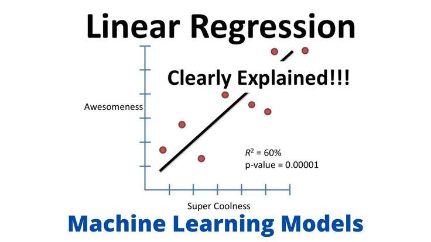

# **Linear Regression Project**
____

## **Overview**
____

This notebook demonstartes an easy-to-follow project that shows how **linear regression** may be used to comprehend feature correlations and make predictions.  Both **simple** and **multiple linear regression** models are implemented in this project, along with **visualization** and **data exploration**.

## **Objectives**
____

- Comprehend the basic concept of **linear regression**
- Perform **Feature distribution** and **Visualization**
- Explore feature relationships using a **simple linear regression** model
- Build and evaluate a **multiple linear regression** model for predictions

## **Tools & Libraries**
---

- `pandas` – for data manipulation
- `matplotlib` / `seaborn` – for visualization
- `scikit-learn` – for linear regression modeling
- `numpy` – for numerical operations

## **Sample Visuals**
---

- Histogram to show data distribution
- Boxplot to show outliers
- Pair plot to show relationships

## 📚 Learning Outcomes

After doing this project, you will comprehend:
 - The inner workings of linear regression
 - The significance of EDA (exploratory data analysis)
 - Regression coefficient interpretation; the distinction between basic and multivariate linear regression

