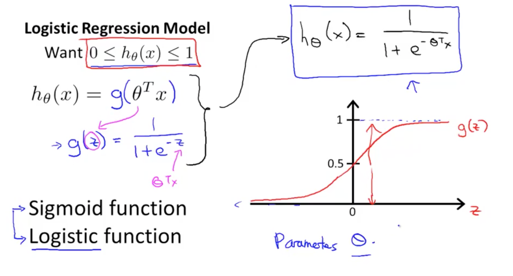

# **Logistic Regression**

____

Using Texas Weather data, this notebook shows how to use **Logistic Regression** to varying types of logistic regressions and to try out probability estimation.  Gaining a thorough grasp of how logistic regression can be used to address various supervised learning issues, with an emphasis on binary and multinomial classification and probability estimation, is the aim.

## **Overview**
_____

**Logistic Regression** is a widely used statistical method for analyzing datasets in which the outcome variable is categorical. It is part of the family of generalized linear models and is particularly useful for classification problems. Despite its name, logistic regression is primarily used for classification, not regression.

In this notebook, we explore three core applications of logistic regression:

- **Binary Logistic Regression**: Used for binary classification problems where the outcome variable has two classes.
- **Multinomial Logistic Regression**: An extension used for multiclass classification tasks where the target variable has more than two categories.
- **Probability Estimation**: Logistic regression models the probability of a sample belonging to a particular class, enabling interpretable, calibrated confidence in predictions.

Logistic regression works by modeling the **log-odds** of the target variable as a linear combination of the input features. The predicted values are passed through a **sigmoid function** to map the outputs to a range between 0 and 1, representing probabilities.

This notebook covers both the usage of **custom implementation of logistic regression** built from scratch using Python and NumPy to deepen understanding of the underlying math and training dynamics.

## **Weather Data Features**
---

The dataset used includes meteorological variables commonly used in weather forecasting:

- Maximum and minimum temperature  
- Humidity  
- Wind speed  
- Precipitation  
- Atmospheric pressure  
- Solar radiation  

These features are used to model and predict outcomes such as whether it will rain tomorrow, or to classify days into weather categories 

## Implementation Details
---

- Data preprocessing and Feature distribution 
- Binary logistic regression implementation using numpy
- Multinomial logistic regression for multi-class classification tasks with a Custom Multinomial logistic regression model  
- Custom implementation of logistic regression using gradient descent  
- Probability estimation using `.predict_proba()` and sigmoid functions  
- Visualization of predicted probabilities and calibration curve  
- Model evaluation with classification metrics and ROC-AUC score  

---

## Libraries Used

- `pandas`: Data manipulation and cleaning  
- `numpy`: Numerical operations and matrix math  
- `scikit-learn`: Logistic regression models and metrics  
- `matplotlib` & `seaborn`: Data visualization and plotting  
- `sklearn.calibration`: For calibration curve and probability analysis  

---

## References

- scikit-learn Documentation – [LogisticRegression](https://scikit-learn.org/stable/modules/generated/sklearn.linear_model.LogisticRegression.html)  
- "Introduction to Statistical Learning" by Gareth James et al.  
- "Python Machine Learning" by Sebastian Raschka  
- Research articles on meteorological modeling and classification 
- Logistic regression (no date) Ritchie Ng. Available at: https://www.ritchieng.com/logistic-regression/ (Accessed: 23 April 2025).  

## Learning Objectives
---

- Understand the mathematics behind logistic regression and the sigmoid function  
- Learn to apply logistic regression for both binary and multiclass classification  
- Estimate and interpret predicted probabilities for decision-making  
- Build a logistic regression model from scratch using gradient descent  
- Evaluate and calibrate logistic regression models for trustworthiness in predictions  

