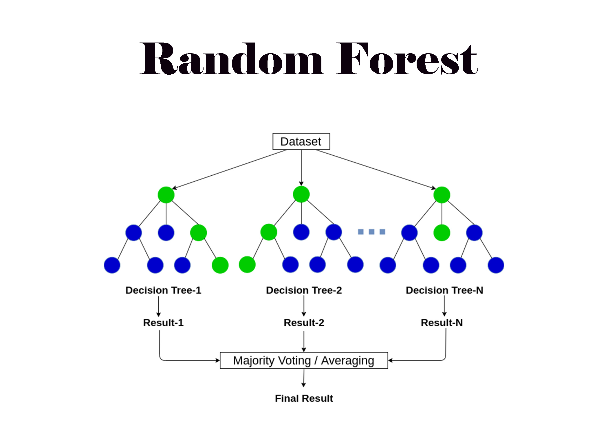

# **Random Forest Rainfall Prediction Project**  
___

## **Overview**  

This notebook shows how to create a **custom Random Forest model** in order to categorize rainfall using the Texas Weather dataset for the purpose of learning.  Understanding how decision trees function separately and how Random Forests integrate them to create a potent ensemble classifier is the aim.  Additionally, it contains **feature distribution**, **confusion matrix analysis** and **model implementation**.

---

## **Objectives**  

- Comprehend the basic concept of Random Forest.
- Peform data exploration and visualization
- Explore feature relationships with Random Forest model
- Build Random Forest Model for for Rainfall prediction

---

## **Tools & Libraries**  

- `pandas` – for data loading and manipulation  
- `numpy` – for mathematical operations  
- `collections.Counter` – for majority voting in ensemble predictions  
- `sklearn.model_selection` – for splitting data into train/test  
-  `matplotlib` and  `seaborn` – for additional visualizations  

---

## **Sample Visuals**  

- Histogram to analyze precipitation data distribution 
- Boxplot humidity and preciptation relationship and to check for outliers. 
- Confusion matrix to analyze predictions 

---

## References

- Scikit-learn Documentation – Random Forests

- Kevin P. Murphy – Machine Learning: A Probabilistic Perspective

- Hands-On Machine Learning with Scikit-Learn, Keras, and TensorFlow – Aurélien Géron

- Image Source & Conceptual Reference: Random Forest Blog by Anas Brital 

___

## 📚 Learning Outcomes

After completing this project, you will:

- Understand how **Random Forest classifiers** make predictions by combining multiple decision trees
- Learn how to write and train a **Decision Tree Classifier from scratch**
- Understand **bootstrapping**, **Gini impurity**, **information gain**, and **majority voting**
- Be able to interpret confusion matrix results to evaluate classification performance

