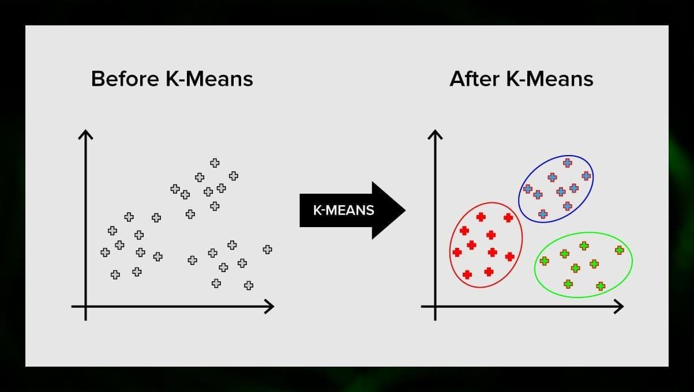

# **K-Means Weather Clustering Project**  
___

## **Overview**  

This notebook shows how to organize and analyze **Texas weather patterns** throughout the year using **K-Means clustering**.  Understanding the mathematical foundations of clustering, putting a customized version of the algorithm into practice, and utilizing feature engineering, scaling, and visualization to uncover seasonal weather regimes are the main objectives.

---

## **Objectives**  

- Comprehend the basic concept of K-Means Clustering.
- Peform data exploration and visualization.
- Explore techniques in K-Means clustering and the math behind it.
- Build K-Means Clustering model for a weather pattern clustering.

---

## **Tools & Libraries**  

- `pandas` – for data manipulation and feature engineering  
- `numpy` – for distance calculations and centroid updates  
- `scikit-learn` – for PCA and data scaling  
- `matplotlib` and `seaborn` – for cluster visualization and EDA

---

## **Sample Visuals**  

- Scatter plots to explore feature distributions of maximum temperature vs. humidity

- Scatter plots to explore feature distributions of wind speed vs. percipitation

- PCA-based cluster plot showing clear separation of weather patterns  

---

## **References**  

Absolutely — here’s a tailored **References** section for your K-Means clustering project that includes sources relevant to the:

- **Mathematical explanation** of K-Means  
- **Custom implementation logic**  
- **Use of cyclical features (month_sin, month_cos)**  
- **Visualization with PCA**  
- And general **clustering best practices**

---

## **References**

- Géron, Aurélien – *Hands-On Machine Learning with Scikit-Learn, Keras & TensorFlow*, 2nd Edition.  
  *(Chapters on Unsupervised Learning and Clustering Algorithms)*

- Raschka, Sebastian & Mirjalili, Vahid – *Python Machine Learning*, 3rd Edition.  
  *(Great resource for implementing clustering from scratch and understanding PCA)*

- Andrew Ng – *Machine Learning (Coursera)*  
  *(Covers the foundational math for K-Means and convergence criteria in clustering)*

- scikit-learn Documentation – [KMeans Clustering](https://scikit-learn.org/stable/modules/clustering.html#k-means)  
  *(Reference for algorithm behavior, parameters, and comparison with custom implementations)*

- Towards Data Science – [“Understanding K-Means Clustering from Scratch”](https://towardsdatascience.com/k-means-clustering-algorithm-applications-evaluation-methods-and-drawbacks-aa03e644b48a)  
  *(Walkthrough of the steps, math, and applications)*

- Denny Britz – [“Implementing K-Means from Scratch”](https://github.com/dennybritz/algorithms)  
  *(Helpful GitHub repo with Python-based clustering logic)*

- Rob J Hyndman – *“Forecasting: Principles and Practice”* (for cyclical time features)  
  *(Discusses handling of seasonal components and time-series-friendly transformations)*

- NOAA & TCEQ – *Texas Climate Data*  
  *(Data context and feature descriptions used in your analysis)*

---

## **Learning Outcomes**

After completing this project, you will:

- Be able to explain and implement **K-Means clustering**
- Understand how to encode **cyclical time features** (like months) 
- Visualize high-dimensional clustering using **PCA**
- Interpret clusters as meaningful **seasonal weather patterns** (for this case).
